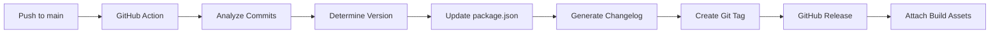

# CLAUDE.md

This file provides guidance to Claude Code (claude.ai/code) when working with code in this repository.

## Project Overview
This is an Angular 20 application with Server-Side Rendering (SSR) using Angular Universal. The project uses standalone components with zoneless change detection for optimal performance.

## Essential Commands

### Development
- `pnpm start` - Start development server at http://localhost:4200/ with hot reload
- `pnpm run build` - Build the application for production
- `pnpm run watch` - Build in watch mode for development
- `pnpm test` - Run unit tests with Karma and Jasmine
- `pnpm run serve:ssr:lescom` - Serve the SSR build locally

### Testing
- `pnpm test` - Run all unit tests
- `ng test --include='**/specific.spec.ts'` - Run specific test file
- `ng test --watch=false` - Run tests once without watching

### Code Quality
- `pnpm run lint` - Check code with ESLint (Airbnb config)
- `pnpm run lint:fix` - Auto-fix linting issues
- `pnpm run format` - Format code with Prettier
- `pnpm run format:check` - Check if code is formatted

### API Generation
- `pnpm run codegen` - Regenerate API client from OpenAPI spec
- `pnpm run fix-api` - Fix API generation issues (runs automatically after codegen)

### Additional Scripts
- `ng` - Angular CLI commands
- `pnpm run semantic-release` - Manual semantic release (usually run by CI)
- `pnpm run prepare` - Husky git hooks setup

## Git Commit Guidelines

### Conventional Commits
This project follows the [Conventional Commits](https://www.conventionalcommits.org/) specification. All commits must be structured as:

```
<type>[optional scope]: <description>

[optional body]

[optional footer(s)]
```

#### Commit Types
- `feat`: New feature
- `fix`: Bug fix
- `docs`: Documentation changes
- `style`: Code style changes (formatting, semicolons, etc.)
- `refactor`: Code refactoring without changing functionality
- `perf`: Performance improvements
- `test`: Adding or updating tests
- `build`: Build system or dependency changes
- `ci`: CI/CD configuration changes
- `chore`: Other changes that don't modify src or test files

#### Examples
```bash
feat: add user authentication
fix: resolve memory leak in data service
docs: update API documentation
style: format code according to Airbnb style guide
refactor: extract common logic into utils
perf: optimize bundle size with lazy loading
test: add unit tests for auth service
build: update Angular to v20
chore: update dependencies
```

### Pre-commit Checks
**IMPORTANT**: Always run linting before committing to ensure code quality:

```bash
# Run lint check
pnpm run lint

# Fix auto-fixable issues
pnpm run lint:fix

# Format code
pnpm run format
```

Husky is configured to run these checks automatically:
- **Pre-commit**: Runs ESLint to ensure code quality
- **Commit-msg**: Validates commit messages follow Conventional Commits format

The hooks will prevent commits if linting fails or commit messages don't follow the convention.

## Automated Versioning & Releases

This project uses **Semantic Release** with GitHub Actions to automatically version and release the application based on conventional commits.

### How It Works

1. **Push to main branch** triggers GitHub Actions workflow
2. **Semantic Release analyzes** commits since last release using conventional commit format
3. **Version is determined** automatically:
   - `feat:` commits → **minor** version bump (0.1.0 → 0.2.0)
   - `fix:` commits → **patch** version bump (0.1.0 → 0.1.1)
   - `BREAKING CHANGE:` in commit body → **major** version bump (0.1.0 → 1.0.0)
4. **package.json is updated** with new version
5. **CHANGELOG.md is generated** automatically from commit messages
6. **Git tag is created** with version number
7. **GitHub Release is published** with release notes
8. **Build artifacts are attached** to the release

### Release Workflow



### Commit Types That Trigger Releases

| Commit Type | Version Bump | Example |
|-------------|--------------|---------|
| `feat:` | Minor (0.1.0 → 0.2.0) | `feat: add user authentication` |
| `fix:` | Patch (0.1.0 → 0.1.1) | `fix: resolve memory leak in data service` |
| `perf:` | Patch (0.1.0 → 0.1.1) | `perf: optimize bundle size` |
| `BREAKING CHANGE:` | Major (0.1.0 → 1.0.0) | Any commit with `BREAKING CHANGE:` in body |

### Commit Types That Don't Trigger Releases

- `docs:` - Documentation changes (except README)
- `style:` - Code formatting changes
- `refactor:` - Code refactoring without functionality change
- `test:` - Adding or updating tests
- `build:` - Build system changes
- `ci:` - CI/CD configuration changes
- `chore:` - Maintenance tasks

### Manual Release Control

- **Skip release**: Add `[skip ci]` to commit message
- **Force release**: Create empty commit with appropriate type:
  ```bash
  git commit --allow-empty -m "fix: trigger patch release"
  ```

### Changelog Format

The generated CHANGELOG.md includes:
- **🚀 Features** - New features (`feat:`)
- **🐛 Bug Fixes** - Bug fixes (`fix:`)
- **⚡ Performance Improvements** - Performance improvements (`perf:`)
- **📚 Documentation** - Documentation changes (`docs:`)
- **🔄 Reverts** - Reverted changes (`revert:`)

### GitHub Release Assets

Each release automatically includes:
- **Source code** (zip and tar.gz)
- **Distribution files** from `dist/` folder
- **Changelog** for the specific version
- **Commit references** and PR links

### Configuration Files

- **`.github/workflows/release.yml`** - GitHub Actions workflow
- **`.releaserc.json`** - Semantic Release configuration
- **`CHANGELOG.md`** - Auto-generated changelog (do not edit manually)

### Best Practices

1. **Write descriptive commit messages** - They become your release notes
2. **Use conventional commit format** - Required for automatic versioning
3. **Include breaking changes** - Add `BREAKING CHANGE:` to commit body when needed
4. **Review generated releases** - Check GitHub releases for accuracy
5. **Don't edit CHANGELOG.md manually** - It's auto-generated

### Example Release Process

```bash
# Developer workflow - no changes needed!
git add feature.ts
git commit -m "feat: add dark mode toggle"
git push origin main

# Automatic result:
# ✅ Version bumped to 0.2.0
# ✅ CHANGELOG.md updated
# ✅ Git tag v0.2.0 created  
# ✅ GitHub release published
# ✅ Build artifacts attached
```

## API Client

The project includes a generated Angular API client in `src/app/api/` created using ng-openapi-gen from OpenAPI specification.

### API Generation
- **Generator**: ng-openapi-gen 
- **Configuration**: `ng-openapi-gen.json`
- **Source**: OpenAPI spec from external endpoint
- **Output**: `src/app/api/`

### API Structure
```
src/app/api/
├── services/           # Service classes for each API endpoint group
│   ├── authentificate.service.ts
│   ├── marketing.service.ts
│   ├── price.service.ts
│   ├── service.ts
│   ├── task-stages.service.ts
│   ├── task-types.service.ts
│   ├── tasks.service.ts
│   └── users.service.ts
├── models/            # TypeScript interfaces for API data
│   ├── body-create-comment-as-task-comments-post.ts
│   ├── bot-create.ts
│   ├── create-buyer-model.ts
│   ├── http-validation-error.ts
│   ├── role-schema.ts
│   ├── task-create.ts
│   ├── task-stage-create.ts
│   ├── task-stage-update.ts
│   ├── task-type-create.ts
│   ├── task-type-update.ts
│   ├── task-update-schema.ts
│   ├── telegram-author.ts
│   ├── user-authorize.ts
│   ├── user-create.ts
│   ├── user-update-schema.ts
│   └── validation-error.ts
├── fn/                # Functional API calls organized by feature
│   ├── authentificate/
│   ├── marketing/
│   ├── price/
│   ├── task-stages/
│   ├── task-types/
│   ├── tasks/
│   ├── users/
│   └── *.ts           # Comment and webhook functions
├── api-configuration.ts # API base configuration
├── api.module.ts      # API module
├── base-service.ts    # Base service class
├── models.ts          # Model exports
├── request-builder.ts # Request builder utility
├── services.ts        # Service exports
└── strict-http-response.ts # HTTP response typing
```

### Available API Features
- **Authentication**: User/bot registration, authorization, Telegram auth
- **Tasks**: CRUD operations, stages, types, comments, Bitrix webhook integration
- **Task Stages**: Create, update, delete task stages
- **Task Types**: Create, update, delete task types with stages
- **Users**: Profile management, roles, user operations
- **Marketing**: Manager and UTM tracking
- **Price**: Buyer items and pricing
- **Comments**: Task comments with photo support

### API Usage
Import services from `src/app/api/services` and inject them into components:
```typescript
import { TasksService } from '../api/services/tasks.service';

constructor(private tasksService = inject(TasksService)) {}
```

## Utility Libraries

### Lodash ES (`lodash-es`)
The project uses **lodash-es** for utility functions with ES module support and tree-shaking optimization.

**Installation:**
```bash
pnpm add lodash-es
pnpm add -D @types/lodash-es
```

**Import Best Practices:**
```typescript
// ✅ Tree-shakable imports (recommended)
import { debounce, throttle, cloneDeep } from 'lodash-es';

// ✅ Specific function imports
import debounce from 'lodash-es/debounce';
import isEqual from 'lodash-es/isEqual';

// ❌ Avoid full library imports (larger bundle)
import _ from 'lodash-es';
```

**Common Use Cases:**

#### Array Utilities
```typescript
import { uniq, groupBy, sortBy, chunk } from 'lodash-es';

// Remove duplicates
const uniqueIds = uniq([1, 2, 2, 3, 4, 4]);

// Group objects by property
const tasksByStatus = groupBy(tasks, 'status');

// Sort by property
const sortedTasks = sortBy(tasks, 'createdAt');

// Split array into chunks
const pages = chunk(items, 10);
```

#### Object Utilities
```typescript
import { cloneDeep, merge, pick, omit } from 'lodash-es';

// Deep clone objects
const taskCopy = cloneDeep(originalTask);

// Merge objects
const updatedTask = merge({}, task, updates);

// Pick specific properties
const taskSummary = pick(task, ['id', 'title', 'status']);

// Omit properties
const taskWithoutMeta = omit(task, ['metadata', 'internal']);
```

#### Function Utilities
```typescript
import { debounce, throttle, memoize } from 'lodash-es';

// Debounce user input
const debouncedSearch = debounce((query: string) => {
  this.searchTasks(query);
}, 300);

// Throttle scroll events
const throttledScroll = throttle(() => {
  this.handleScroll();
}, 100);

// Memoize expensive calculations
const memoizedCalculation = memoize((data: any[]) => {
  return data.reduce((sum, item) => sum + item.value, 0);
});
```

#### Collection Utilities
```typescript
import { find, filter, map, reduce } from 'lodash-es';

// Find by condition
const activeTask = find(tasks, { status: 'active' });

// Filter with complex conditions
const urgentTasks = filter(tasks, task => 
  task.priority === 'high' && task.dueDate < new Date()
);

// Transform data
const taskTitles = map(tasks, 'title');

// Aggregate data
const totalValue = reduce(tasks, (sum, task) => sum + task.value, 0);
```

#### Type Checking
```typescript
import { isArray, isObject, isString, isEmpty } from 'lodash-es';

// Type guards
if (isArray(data)) {
  data.forEach(item => processItem(item));
}

if (isObject(value) && !isArray(value)) {
  Object.keys(value).forEach(key => processKey(key));
}

// Empty checks
if (!isEmpty(searchQuery)) {
  performSearch(searchQuery);
}
```

**Angular-Specific Patterns:**

#### Service with Lodash
```typescript
import { Injectable } from '@angular/core';
import { debounce, uniqBy } from 'lodash-es';

@Injectable({
  providedIn: 'root'
})
export class TaskService {
  private debouncedSave = debounce(this.saveTask.bind(this), 1000);

  processUniqueTasks(tasks: Task[]): Task[] {
    return uniqBy(tasks, 'id');
  }

  queueSave(task: Task): void {
    this.debouncedSave(task);
  }

  private saveTask(task: Task): void {
    // Save implementation
  }
}
```

#### Component with Lodash
```typescript
import { Component, inject } from '@angular/core';
import { groupBy, sortBy } from 'lodash-es';

@Component({
  selector: 'app-task-list',
  templateUrl: './task-list.component.html'
})
export class TaskListComponent {
  tasks = signal<Task[]>([]);
  
  groupedTasks = computed(() => {
    const tasks = this.tasks();
    return groupBy(sortBy(tasks, 'priority'), 'status');
  });
}
```

#### Form Utilities
```typescript
import { isEqual, cloneDeep } from 'lodash-es';

export class FormComponent {
  originalData = signal<any>(null);
  currentData = signal<any>(null);
  
  hasChanges = computed(() => {
    return !isEqual(this.originalData(), this.currentData());
  });
  
  resetForm(): void {
    this.currentData.set(cloneDeep(this.originalData()));
  }
}
```

**Performance Considerations:**
- Use specific imports for optimal tree-shaking
- Prefer native JavaScript methods when performance is critical
- Use `memoize` for expensive computations
- Be mindful of `cloneDeep` with large objects

**Common Patterns to Avoid:**
```typescript
// ❌ Don't import the entire library
import _ from 'lodash-es';

// ❌ Don't use when native alternatives exist
import { forEach } from 'lodash-es';
// Use: array.forEach() instead

// ❌ Don't overuse utility functions for simple operations
import { isEmpty } from 'lodash-es';
// Use: array.length === 0 for arrays
```

## Design System & Styling

### Theme Configuration
The project uses **Tailwind CSS v4** with a custom Supabase-inspired theme located in `src/theme.css`. The theme includes:

- **Design System**: Light/dark mode support with CSS custom properties
- **Color Palette**: Primary green (`#72e3ad`), muted grays, and semantic colors
- **Typography**: Outfit font family with proper letter spacing
- **Component Library**: Pre-built button, card, input, and badge styles

### Available CSS Classes

#### Buttons
```html
<button class="btn-primary">Primary Button</button>
<button class="btn-secondary">Secondary Button</button>
<button class="btn-destructive">Destructive Button</button>
<button class="btn-primary btn-sm">Small Button</button>
<button class="btn-primary btn-lg">Large Button</button>
```

#### Cards
```html
<div class="card">
  <div class="card-header">
    <h3 class="card-title">Card Title</h3>
  </div>
  <div class="card-content">Card content goes here</div>
</div>
```

#### Form Elements
```html
<input class="input" placeholder="Enter text..." />
<input class="input input-error" placeholder="Error state" />
<input class="input input-success" placeholder="Success state" />
```

#### Badges
```html
<span class="badge badge-success">Success</span>
<span class="badge badge-info">Info</span>
<span class="badge badge-warning">Warning</span>
<span class="badge badge-destructive">Error</span>
```

#### Layout Utilities
```html
<div class="container-responsive">Responsive container</div>
<div class="container-md">Medium container</div>
<div class="container-lg">Large container</div>
```

### Theme Features
- **Active States**: Buttons include enhanced active states with `rounded-xl` border radius and subtle scaling
- **Focus Management**: Thin, transparent focus rings (`ring-2 ring-ring/30`)
- **Dark Mode**: Automatic dark mode with softer text colors (`#d1d5db` instead of pure white)
- **Transitions**: Smooth `transition-all duration-200` on interactive elements

### Styling Guidelines
1. **Use Theme Classes**: Prefer predefined classes over custom styles
2. **Consistent Spacing**: Use theme's spacing scale (`--spacing-*`)
3. **Color Variables**: Reference CSS custom properties (`var(--color-*)`)
4. **Responsive Design**: Use breakpoint variables (`--breakpoint-*`)

## UI Component Library

The project includes a custom UI component library located in `src/app/ui/` that provides reusable components built on top of the theme system.

### Available Components & Directives

#### Button Directive (`/src/app/ui/button/button.directive.ts`)
A flexible button directive that enhances native button elements with variant and size support.

**Import:**
```typescript
import { ButtonDirective } from '../ui';
```

**Usage:**
```html
<button appButton variant="primary" size="default" (pressed)="handleClick()">
  Click me
</button>

<button appButton variant="secondary" size="sm" [disabled]="isDisabled">
  Small Button
</button>

<button appButton variant="destructive" size="lg" class="w-full">
  Large Destructive Button
</button>
```

**Props:**
- `variant`: `'primary' | 'secondary' | 'destructive'` (default: `'primary'`)
- `size`: `'sm' | 'default' | 'lg'` (default: `'default'`)
- `disabled`: `boolean` (default: `false`)
- `type`: `'button' | 'submit' | 'reset'` (default: `'button'`)
- Additional CSS classes can be added directly to the button element

**Events:**
- `(pressed)`: Emitted when button is clicked (if not disabled)

#### Stack Directive (`/src/app/ui/stack/stack.directive.ts`)
A layout directive that transforms any element into a flexible container with configurable spacing and alignment.

**Import:**
```typescript
import { StackDirective } from '../ui';
```

**Usage:**
```html
<!-- Horizontal button group -->
<div appStack direction="row" gap="4" justify="center" align="center">
  <button appButton variant="primary">Button 1</button>
  <button appButton variant="secondary">Button 2</button>
</div>

<!-- Vertical form layout -->
<div appStack direction="column" gap="6">
  <input class="input" placeholder="Name" />
  <input class="input" placeholder="Email" />
  <button appButton variant="primary">Submit</button>
</div>

<!-- Responsive grid alternative -->
<div appStack direction="row" gap="4" [wrap]="true" justify="between">
  <div>Item 1</div>
  <div>Item 2</div>
  <div>Item 3</div>
</div>
```

**Props:**
- `direction`: `'row' | 'column' | 'row-reverse' | 'column-reverse'` (default: `'row'`)
- `gap`: `'0' | '1' | '2' | '3' | '4' | '5' | '6' | '8' | '10' | '12' | '16' | '20' | '24'` (default: `'4'`)
- `align`: `'start' | 'center' | 'end' | 'stretch' | 'baseline'` (default: `'center'`)
- `justify`: `'start' | 'center' | 'end' | 'between' | 'around' | 'evenly'` (default: `'start'`)
- `wrap`: `boolean` (default: `false`)
- Additional CSS classes can be added directly to the element

#### Form Field Component (`/src/app/ui/form-field/form-field.component.ts`)
A comprehensive form field wrapper component that provides labels, hints, error handling, and form control integration.

**Import:**
```typescript
import { FormFieldComponent } from '../ui';
```

**Usage:**
```html
<app-form-field 
  label="Email Address"
  hint="We'll never share your email"
  [required]="true"
  [control]="emailControl"
  type="email"
  placeholder="Enter your email"
  size="default">
</app-form-field>
```

**Features:**
- Form control integration with automatic error display
- Label and hint text support
- Required field indicators
- Multiple input types (text, email, password, number, tel, url, search)
- Size variants (sm, default, lg)
- Automatic error message generation for common validators
- Custom error message support
- Pass-through properties to underlying input component
- Full ControlValueAccessor implementation

#### Input Component (`/src/app/ui/input/input.component.ts`)
A comprehensive form input component with various states and features.

**Import:**
```typescript
import { InputComponent } from '../ui';
```

**Features:**
- Multiple input types (text, email, password, number, etc.)
- Size variants (sm, default, lg)
- State variants (default, error, success)
- Loading state with spinner
- Password visibility toggle
- Clearable input for search
- Icon support (left/right)
- Full form control support with ControlValueAccessor

### UI Component Guidelines

1. **Component Structure**: All UI components follow the standalone component pattern
2. **Template Files**: Components use separate HTML files (`.html`) instead of inline templates
3. **Type Safety**: All component props use TypeScript interfaces for better DX
4. **Theme Integration**: Components leverage the existing theme classes and CSS custom properties
5. **Flexibility**: Components accept additional CSS classes via the `class` prop
6. **Accessibility**: Components include proper ARIA attributes and semantic HTML

### Creating New UI Components

When creating new UI components:

1. **Location**: Place in `src/app/ui/` directory
2. **Naming**: Use PascalCase for class names, kebab-case for selectors
3. **Structure**: Create separate `.ts` and `.html` files
4. **Exports**: Export TypeScript interfaces for props
5. **Theme**: Use existing theme classes and CSS custom properties
6. **Documentation**: Add component to this CLAUDE.md file

**Current UI component structure:**
```
src/app/ui/
├── badge/
│   ├── badge.component.html   # Badge template
│   ├── badge.component.ts     # Badge component
│   ├── badge.component.spec.ts # Badge tests
│   └── index.ts               # Badge exports
├── button/
│   ├── button.directive.ts    # Button directive
│   └── index.ts               # Button exports
├── form-field/
│   ├── form-field.component.ts    # Form field component
│   ├── form-field.component.html  # Form field template
│   └── index.ts                   # Form field exports
├── input/
│   ├── input.component.ts     # Input component
│   ├── input.component.html   # Input template
│   └── index.ts               # Input exports
├── stack/
│   ├── stack.directive.ts     # Stack directive
│   └── index.ts               # Stack exports
└── index.ts                   # Main barrel export
```

## Architecture & Code Organization

### Key Technical Decisions
- **Standalone Components**: All components use the standalone API (no NgModules)
- **Zoneless Change Detection**: Application runs without Zone.js using `provideZonelessChangeDetection()`
- **Separate Template Files**: Components use separate HTML template files instead of inline templates
- **Component Prefix**: Use `app-` prefix for all component selectors
- **Design System**: Tailwind CSS v4 with custom theme for consistent UI

### File Structure
```
src/
├── app/
│   ├── app.ts                    # Root component
│   ├── app.config.ts             # Client app configuration
│   ├── app.config.server.ts      # Server app configuration  
│   ├── app.routes.ts             # Client-side routes
│   ├── app.routes.server.ts      # Server-side routes
│   ├── app.spec.ts               # Root component tests
│   ├── api/                      # Generated API client
│   │   ├── services/             # Service classes for API endpoints
│   │   │   ├── authentificate.service.ts
│   │   │   ├── marketing.service.ts
│   │   │   ├── price.service.ts
│   │   │   ├── service.ts
│   │   │   ├── task-stages.service.ts
│   │   │   ├── task-types.service.ts
│   │   │   ├── tasks.service.ts
│   │   │   └── users.service.ts
│   │   ├── models/               # TypeScript interfaces for API data
│   │   │   ├── body-create-comment-as-task-comments-post.ts
│   │   │   ├── bot-create.ts
│   │   │   ├── create-buyer-model.ts
│   │   │   ├── http-validation-error.ts
│   │   │   ├── role-schema.ts
│   │   │   ├── task-create.ts
│   │   │   ├── task-stage-create.ts
│   │   │   ├── task-stage-update.ts
│   │   │   ├── task-type-create.ts
│   │   │   ├── task-type-update.ts
│   │   │   ├── task-update-schema.ts
│   │   │   ├── telegram-author.ts
│   │   │   ├── user-authorize.ts
│   │   │   ├── user-create.ts
│   │   │   ├── user-update-schema.ts
│   │   │   └── validation-error.ts
│   │   ├── fn/                   # Functional API calls by feature
│   │   │   ├── authentificate/   # Authentication endpoints
│   │   │   ├── marketing/        # Marketing endpoints
│   │   │   ├── price/            # Pricing endpoints
│   │   │   ├── task-stages/      # Task stages endpoints
│   │   │   ├── task-types/       # Task types endpoints
│   │   │   ├── tasks/            # Task management endpoints
│   │   │   ├── users/            # User management endpoints
│   │   │   └── *.ts              # Comment and webhook functions
│   │   ├── api-configuration.ts  # API base configuration
│   │   ├── api.module.ts         # API module
│   │   ├── base-service.ts       # Base service class
│   │   ├── models.ts             # Model exports
│   │   ├── request-builder.ts    # Request builder utility
│   │   ├── services.ts           # Service exports
│   │   └── strict-http-response.ts # HTTP response typing
│   ├── components/               # Shared components
│   │   └── environment-info.component.ts
│   ├── demo/                     # Demo components
│   │   └── form-field-demo.component.ts
│   ├── pages/                    # Page components
│   │   └── ui-kit/               # UI kit showcase page
│   │       ├── ui-kit.html       # UI kit template
│   │       ├── ui-kit.ts         # UI kit component
│   │       └── ui-kit.spec.ts    # UI kit tests
│   ├── services/                 # Application services
│   │   └── environment.service.ts
│   ├── ui/                       # UI component library
│   │   ├── badge/                # Badge component
│   │   │   ├── badge.component.html
│   │   │   ├── badge.component.ts
│   │   │   ├── badge.component.spec.ts
│   │   │   └── index.ts
│   │   ├── button/               # Button directive
│   │   │   ├── button.directive.ts
│   │   │   └── index.ts
│   │   ├── form-field/           # Form field component
│   │   │   ├── form-field.component.html
│   │   │   ├── form-field.component.ts
│   │   │   └── index.ts
│   │   ├── input/                # Input component
│   │   │   ├── input.component.html
│   │   │   ├── input.component.ts
│   │   │   └── index.ts
│   │   ├── stack/                # Stack layout directive
│   │   │   ├── stack.directive.ts
│   │   │   └── index.ts
│   │   └── index.ts              # UI barrel exports
│   └── utils/                    # Utility functions
│       ├── class-names.util.ts   # CSS class utility
│       ├── class-names.util.spec.ts # Class utility tests
│       └── index.ts              # Utils barrel exports
├── environments/                 # Environment configuration
│   ├── environment.ts            # Base environment
│   ├── environment.development.ts # Development config
│   └── environment.prod.ts       # Production config
├── index.html                    # HTML entry point
├── main.ts                       # Client bootstrap
├── main.server.ts                # Server bootstrap
├── server.ts                     # Express server for SSR
├── styles.css                    # Global styles
└── theme.css                     # Tailwind theme configuration
```

### Root Directory Structure
```
project-root/
├── src/                          # Source code
├── dist/                         # Build output
├── public/                       # Static assets
│   └── favicon.ico
├── scripts/                      # Build and utility scripts
│   ├── compush.sh               # Commit and push script
│   └── fix-api-generation.js    # API generation fixes
├── node_modules/                 # Dependencies
├── angular.json                  # Angular CLI configuration
├── eslint.config.mjs            # ESLint configuration
├── ng-openapi-gen.json          # API generation config
├── package.json                 # Package configuration
├── pnpm-lock.yaml               # Lock file for pnpm
├── tailwind.config.ts           # Tailwind CSS configuration
├── tsconfig.json                # TypeScript base config
├── tsconfig.app.json            # App-specific TypeScript config
├── tsconfig.spec.json           # Test-specific TypeScript config
├── supabase-theme.css           # Additional theme file
├── CLAUDE.md                    # Project documentation
├── README.md                    # Project readme
├── CHANGELOG.md                 # Auto-generated changelog
├── LESCOM_WEBSITE_ANALYSIS.md   # Website analysis
├── TAILWIND_DESIGN_SYSTEM.md    # Design system docs
└── TAILWIND_V4_SETUP.md         # Tailwind v4 setup guide
```

### Configuration Files
- `angular.json` - Angular CLI configuration, uses pnpm as package manager
- `tsconfig.json` - TypeScript strict mode enabled with Angular-specific options
- `server.ts` - Express server setup for SSR

### Path Mappings
The project uses TypeScript path mappings for cleaner imports:

```typescript
// tsconfig.app.json & tsconfig.spec.json
"paths": {
  "@ui": ["app/ui"],
  "@ui/*": ["app/ui/*"],
  "@utils": ["app/utils"],
  "@utils/*": ["app/utils/*"]
}
```

**Usage Examples:**
```typescript
// UI components
import { ButtonDirective } from '@ui/button';
import { InputComponent } from '@ui/input';
import { StackDirective } from '@ui/stack';

// Utility functions
import { cn } from '@utils';
import { classNames } from '@utils/class-names.util';

// Specific utilities
import { cn } from '@utils/class-names.util';
```

**Path Mapping Benefits:**
- Cleaner, more readable imports
- Easier refactoring when moving files
- IDE autocompletion support
- Consistent import paths across the project

### Important Angular Patterns
1. **Component Creation**: Use Angular CLI: `ng generate component name --standalone`
2. **Template Files**: ALWAYS create separate `.html` files for component templates using `templateUrl` instead of inline `template`
3. **Route Configuration**: Add routes to `app.routes.ts` as const arrays
4. **Service Injection**: Use `inject()` function in constructors or field initializers
5. **Change Detection**: Call `ChangeDetectorRef.markForCheck()` when needed (zoneless)
6. **Signal APIs**: ALWAYS use signal-based `input()` and `output()` functions instead of decorator-based `@Input()` and `@Output()` for component properties and events

### SSR Considerations
- Server-specific logic goes in `app.config.server.ts`
- Use `isPlatformBrowser()/isPlatformServer()` for platform-specific code
- Client hydration is enabled with event replay
- Avoid direct DOM manipulation; use Angular APIs instead

## Development Guidelines

### TypeScript Configuration
The project enforces strict TypeScript settings:
- All strict checks enabled
- No implicit any, returns, or property access
- Explicit override annotations required
- Angular template strict mode enabled

### Testing Approach
- Unit tests use Karma + Jasmine
- Test files follow `*.spec.ts` naming convention
- Tests should use `TestBed` with zoneless change detection
- No E2E testing framework configured yet

### Build Optimization
- Initial bundle budget: 500kB
- Component style budget: 4kB
- Production builds use optimization and minification
- Source maps disabled in production

## Available MCP Servers

Claude Code has access to several MCP (Model Context Protocol) servers that provide additional capabilities beyond the basic tools. These servers extend Claude's functionality for specific use cases.

### GitHub Server (`mcp__github-server__*`)
Provides comprehensive GitHub integration for repository management, issues, pull requests, and code operations.

**Available Functions:**
- **Repository Management**: Create, fork, search repositories
- **File Operations**: Get file contents, create/update files, push multiple files
- **Branch Management**: Create branches, list commits
- **Issues**: Create, list, update, get issues, add comments, search issues
- **Pull Requests**: Create, list, get, merge PRs, manage reviews, get files/status/comments
- **Code Search**: Search code across repositories
- **User Search**: Find GitHub users

**Usage Examples:**
```typescript
// Search for repositories
mcp__github-server__search_repositories({ query: "angular ssr" })

// Create a new issue
mcp__github-server__create_issue({ 
  owner: "username", 
  repo: "project", 
  title: "Bug report",
  body: "Description of the issue" 
})

// Get file contents
mcp__github-server__get_file_contents({
  owner: "username",
  repo: "project", 
  path: "src/app/component.ts"
})
```

### Context7 Library Documentation (`mcp__context7__*`)
Provides access to up-to-date documentation for libraries and frameworks.

**Available Functions:**
- **Library Resolution**: `resolve-library-id` - Convert library names to Context7 IDs
- **Documentation Fetch**: `get-library-docs` - Retrieve comprehensive library documentation

**Usage Examples:**
```typescript
// First resolve the library ID
mcp__context7__resolve-library-id({ libraryName: "Angular" })

// Then get documentation with the resolved ID
mcp__context7__get-library-docs({ 
  context7CompatibleLibraryID: "/angular/angular",
  topic: "routing",
  tokens: 10000
})
```

### Playwright Browser Automation (`mcp__playwright__*`)
Enables browser automation for testing, screenshots, and web interactions.

**Available Functions:**
- **Browser Control**: Install, close, resize, navigate (back/forward)
- **Page Interaction**: Click, type, hover, drag, select options
- **Content Capture**: Screenshots, snapshots, PDF generation
- **Tab Management**: List, create, select, close tabs
- **Debugging**: Console messages, network requests, handle dialogs
- **Test Generation**: Generate Playwright test code
- **File Operations**: Upload files
- **Waiting**: Wait for elements, text, or time

**Usage Examples:**
```typescript
// Navigate to a page
mcp__playwright__browser_navigate({ url: "https://example.com" })

// Take a screenshot
mcp__playwright__browser_take_screenshot({ filename: "page.png" })

// Click an element
mcp__playwright__browser_click({ 
  element: "Submit button",
  ref: "button[type='submit']" 
})

// Generate a test
mcp__playwright__browser_generate_playwright_test({
  name: "Login Test",
  description: "Test user login functionality",
  steps: ["Navigate to login page", "Enter credentials", "Click submit"]
})
```

### MCP Server Guidelines

1. **Always prefer MCP tools** when available over basic tools for specialized tasks
2. **Use appropriate namespacing** - all MCP functions are prefixed with `mcp__<server-name>__`
3. **Check function signatures** - MCP functions have specific parameter requirements
4. **Combine MCP servers** - Use multiple servers together for complex workflows
5. **Error handling** - MCP functions may have different error patterns than basic tools

### Common MCP Workflows

**GitHub + Documentation Workflow:**
```typescript
// 1. Search for a repository
mcp__github-server__search_repositories({ query: "next.js" })

// 2. Get documentation for the library
mcp__context7__resolve-library-id({ libraryName: "Next.js" })
mcp__context7__get-library-docs({ context7CompatibleLibraryID: "/vercel/next.js" })

// 3. Create an issue with documentation insights
mcp__github-server__create_issue({ /* issue details */ })
```

**Browser Testing + GitHub Workflow:**
```typescript
// 1. Navigate to application
mcp__playwright__browser_navigate({ url: "http://localhost:4200" })

// 2. Take screenshot of current state
mcp__playwright__browser_take_screenshot({ filename: "before.png" })

// 3. Generate test code
mcp__playwright__browser_generate_playwright_test({ /* test details */ })

// 4. Create PR with test code
mcp__github-server__create_pull_request({ /* PR details */ })
```
